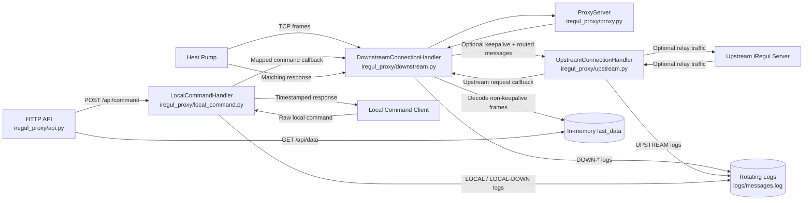
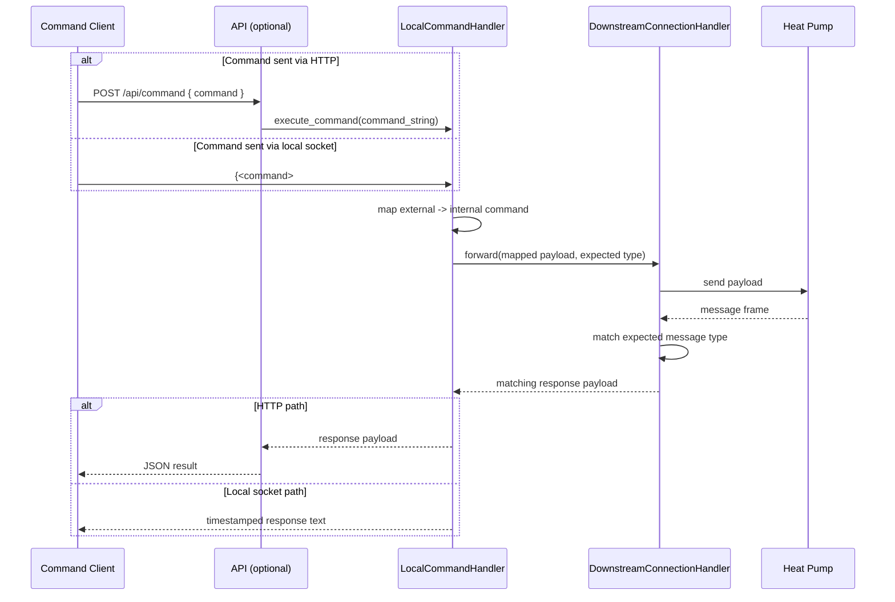
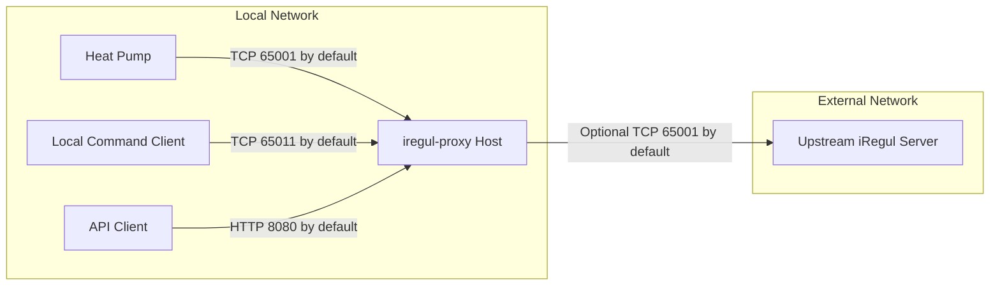

# Architecture and Functional Description

## 1. Objective

`iregul-proxy` is a local integration service for iRegul-compatible heat pumps.
Its role is to sit between a heat pump and an optional upstream iRegul server,
while exposing the latest decoded data through an HTTP API.

The system is designed as one runtime process composed of three functional applications:

1. TCP proxy application (heat pump <-> proxy, optional proxy <-> upstream)
2. HTTP API application (read and command endpoints)
3. Local command socket application (local command injection)

## 2. Functional Scope

The platform provides the following end-user capabilities:

- Accept incoming TCP connections from a heat pump.
- Maintain one active downstream heat pump session at a time.
- Optionally forward traffic bidirectionally between heat pump and upstream server.
- Decode downstream heat pump frames and keep the latest decoded payload in memory.
- Expose health and latest decoded data over REST.
- Send local/API commands to the currently connected heat pump and return command responses.
- Persist traffic logs to rotating files for diagnostics.

## 3. Application Breakdown

## 3.1 TCP Proxy Application

Main responsibility: downstream session ownership, optional upstream relay, and
frame processing.

Input:
- TCP connection from heat pump on `PROXY_HOST:PROXY_PORT`.

Output:
- Optional TCP connection to upstream on `UPSTREAM_HOST:UPSTREAM_PORT`
  when `UPSTREAM_ENABLED=true`.
- Decoded in-memory state (`last_data`) used by API.
- Message logs in `LOG_DIR/messages.log` with rotation.

Functional behavior:
- Accepts only one active downstream client; additional downstream clients are rejected.
- Starts/maintains upstream relay only when enabled and after downstream client connect.
- Forwards downstream keepalive frames to upstream when relay is enabled.
- Handles upstream-initiated request frames by routing them through downstream and returning matching responses.
- Reads messages as frame-like chunks ending with `}`.
- Applies read timeout (`READUNTIL_TIMEOUT`) to downstream reads.
- Tries to decode downstream payloads with `aioiregul`.
- Ignores keepalive frames for API state updates.
- Updates the latest decoded payload for non-keepalive frames.
- Correlates command/response by expected downstream message type and serializes requests.
- Optionally logs known downstream message types (`10`, `200`) based on `LOG_DOWNSTREAM`.

## 3.2 HTTP API Application

Main responsibility: expose service state and command execution over HTTP.

Binding:
- `API_HOST:API_PORT`

Endpoints:
- `GET /api/health`
  - Returns service health and downstream connection status.
- `GET /api/data`
  - Returns latest decoded heat pump payload if available.
  - Returns `no_data` status when no frame has been decoded yet.
- `POST /api/command`
  - Accepts a command string and forwards it as-is to local command execution.
  - Uses the same execution path as local command handling (`execute_command`).
  - Returns command response content.

Documentation:
- OpenAPI docs served by FastAPI/Swagger at `/docs`.

## 3.3 Local Command Socket Application

Main responsibility: local command bridge over raw TCP socket.

Binding:
- `LOCAL_COMMAND_HOST:LOCAL_COMMAND_PORT`

Command flow:
- Reads one command frame from local client (expected format includes `{<command>#}`).
- Extracts external command.
- Maps external command to internal command (current map: `502 -> 200`, `501 -> 10`).
- Rebuilds downstream payload with mapped command and forwards it to active downstream connection.
- Waits for matching response type with timeout.
- Returns response with rewritten local timestamp prefix.
- Allows one active local command client; additional local command clients are rejected.

Failure modes:
- Invalid frame format returns explicit error text.
- No active downstream connection returns explicit error text.
- Timeout returns explicit timeout text.

## 4. Runtime Lifecycle

Startup sequence:
1. Load configuration from environment and optional `.env`.
2. Start downstream proxy listener.
3. Start local command socket listener.
4. Initialize API server runner and start HTTP API server.
5. Upstream relay (if enabled) begins when a downstream client connects.

Shutdown sequence:
1. Receive shutdown signal (`SIGINT`/`SIGTERM`).
2. Stop accepting new downstream and local command connections.
3. Cancel active downstream/local command tasks.
4. Stop upstream relay task if enabled.
5. Close sockets and finish graceful shutdown.

## 5. Data Model (In-Memory)

Latest decoded payload is stored in memory and returned by `GET /api/data`.
Typical fields:
- `timestamp`
- `is_old`
- `count`
- `groups`
- `raw`

Notes:
- No persistent database is used.
- State is lost on restart.

## 6. Configuration Inputs

Configuration is provided via environment variables (or `.env`):

- `PROXY_HOST`, `PROXY_PORT`
- `UPSTREAM_ENABLED`
- `UPSTREAM_HOST`, `UPSTREAM_PORT`
- `API_HOST`, `API_PORT`
- `LOCAL_COMMAND_HOST`, `LOCAL_COMMAND_PORT`
- `LOG_DOWNSTREAM`
- `LOG_DIR`, `LOG_MAX_BYTES`, `LOG_BACKUP_COUNT`
- `READUNTIL_TIMEOUT`

## 7. Observability

Logs are produced through standard Python logging plus dedicated rotating message logs.

Message log sources include:
- `DOWN-UNKNOWN`, `DOWN-UPS`, `DOWN-LOC`
- `UPSTREAM`
- `LOCAL`
- `LOCAL-DOWN`

## 8. Current Non-Goals

The current architecture intentionally does not include:
- Persistent storage of historical heat pump data.
- Authentication/authorization on API endpoints.
- Multi-node clustering or distributed state.
- Guaranteed command delivery across reconnects.

## 9. Module Mapping

- Runtime orchestration: `iregul_proxy/main.py`
- Proxy composition and wiring: `iregul_proxy/proxy.py`
- Downstream session handling and decoding: `iregul_proxy/downstream.py`
- Upstream relay handling: `iregul_proxy/upstream.py`
- Local command handling and command mapping: `iregul_proxy/local_command.py`
- HTTP API: `iregul_proxy/api.py`
- Configuration loader: `iregul_proxy/config.py`

## 10. Functional Flow Diagram

### 10.1 Command Sequence (Local Socket or API)

## 11. Network Architecture

This section describes the runtime network footprint of the service.

### 11.1 Network Topology

### 11.2 Port Matrix

| Purpose | Direction | Default | Config Variables | Protocol |
|---|---|---:|---|---|
| Heat pump downstream listener | Inbound to proxy | 65001 | PROXY_HOST, PROXY_PORT | TCP |
| Upstream relay connection (optional) | Outbound from proxy | 65001 | UPSTREAM_ENABLED, UPSTREAM_HOST, UPSTREAM_PORT | TCP |
| HTTP API listener | Inbound to proxy | 8080 | API_HOST, API_PORT | HTTP/TCP |
| Local command listener | Inbound to proxy | 65011 | LOCAL_COMMAND_HOST, LOCAL_COMMAND_PORT | TCP |

### 11.3 Traffic Rules and Behavior

- Downstream and upstream relay are stateful streams using framed messages ending with }.
- At most one downstream heat pump connection is active at a time.
- At most one local command client is active at a time.
- When enabled, upstream relay reconnects automatically and does not block local/API command paths.
- Local command traffic is point-to-point and requires an active downstream connection.
- API command requests and local socket commands both converge to `LocalCommandHandler.execute_command`.
- Read timeout protection is applied on downstream reads, local command reads, and command-response waits.

### 11.4 Deployment Notes

- For a LAN-only deployment, bind API and local command listeners to a private interface.
- If exposing API externally, add reverse proxy and authentication in front of the service.
- Ensure outbound access from proxy host to the configured upstream host and port.
- Keep local command port restricted to trusted clients only.
